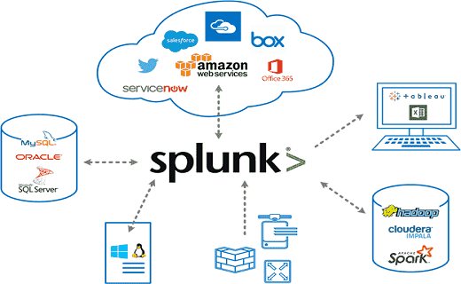
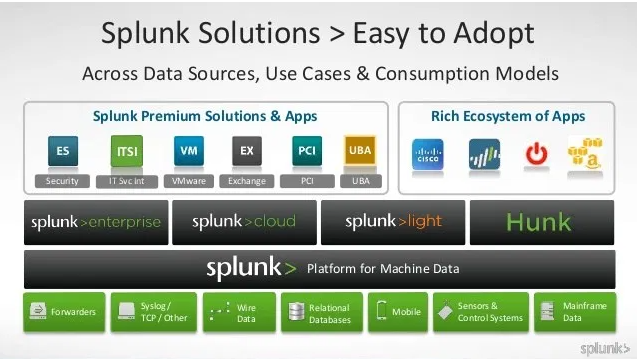

<!-- _class: lead -->
<!-- _paginate: false -->

# SIEM

---

## Sommaire

- Introduction au SIEM
- Composants d'un SIEM
- Deploiement et configuration d'un SIEM
- Surveillance et gestion des incidents au sein d'un SIEM
- Exemple de SIEM avec Splunk

--- 

<!-- _class: lead -->
<!-- _paginate: false -->

## Introduction au SIEM

---

## Rappel SOC

 

**Definition**

 

Un **SOC (Security Operations Center)** est une structure centralisée, au sein d'une organisation, dédiée à la surveillance, à la détection, à l'analyse et à la réponse aux incidents de sécurité informatique. Son principal objectif est de protéger les actifs numériques d'une entreprise, tels que les réseaux, les systèmes, les données et les informations confidentielles, contre les cybermenaces.

 
--- 

## Rappel SOC

**Fonctionnement**

- Le SOC fonctionne en surveillant en permanence l'infrastructure informatique d'une organisation à l'aide d'outils de sécurité spécialisés comme les SIEM (Security Information and Event Management), les IDS/IPS (Intrusion Detection System/Intrusion Prevention System), les pare-feu, les antivirus, et autres technologies de surveillance. 
- Ces outils collectent des données en temps réel, générant des alertes lorsqu'un comportement suspect ou une activité malveillante est détectée.

- Les analystes du SOC étudient ces alertes pour déterminer la nature de l'incident, son impact potentiel, et les mesures correctives nécessaires. 
- Le SOC est également responsable de la gestion des incidents, de la récupération post-incident, de l'analyse forensique, et du renforcement des défenses après une attaque.

---

## Rappel SOC

 

**Exemple**

1. **Protéger une Grande Entreprise Multinationale :**
   - Une entreprise comme **Microsoft** ou **Amazon** possède un SOC mondial pour surveiller en continu leurs vastes infrastructures cloud et IT. Ce SOC est chargé de détecter toute tentative de compromission des données de millions d'utilisateurs et d'intervenir en cas de cyberattaque sophistiquée.
   - Par exemple, lorsqu'une attaque par phishing ciblée est détectée, le SOC peut rapidement isoler les systèmes compromis, avertir les utilisateurs concernés, et initier des actions de correction tout en analysant les vecteurs d'attaque pour prévenir de futures intrusions.

---

## Rappel SOC

 

**Exemple**

2. **Sécurité d'une Institution Financière :**
   - Une banque telle que **BNP Paribas** ou **JPMorgan Chase** a un SOC pour surveiller les transactions bancaires et prévenir la fraude en ligne. En cas de tentative de piratage d’un compte bancaire ou de transfert non autorisé, le SOC intervient pour bloquer la transaction, sécuriser les comptes affectés, et analyser les méthodes utilisées par les cybercriminels pour améliorer la sécurité future.
   - Lorsqu'un SOC détecte des activités suspectes sur plusieurs comptes clients à travers le monde, il peut déclencher une alerte mondiale et mettre en place des mesures temporaires comme l’authentification multi-facteurs pour les transactions sensibles.

---

## Rappel SOC

**Qui Travaille dans un SOC ?**

1. **Analystes SOC (Tier 1, Tier 2, Tier 3) :**
   - **Tier 1 - Analyste SOC Junior :**
     - **Rôle :** Surveillance en temps réel des alertes, triage des incidents, première analyse des événements, escalade des incidents au besoin.
     - **Compétences :** Bonne compréhension des concepts de cybersécurité, capacité à utiliser des outils de monitoring, solides compétences analytiques.
   - **Tier 2 - Analyste SOC Intermédiaire :**
     - **Rôle :** Investigation approfondie des incidents, analyse des attaques complexes, réponse aux incidents, recommandation de mesures correctives.
     - **Compétences :** Expertise en analyse forensique, compréhension approfondie des réseaux et des systèmes, expérience pratique des incidents de sécurité.
   - **Tier 3 - Analyste SOC Senior / Expert en Réponse aux Incidents :**
     - **Rôle :** Gestion des incidents critiques, analyse avancée des cyberattaques, développement de stratégies de défense, mentorat pour les analystes de niveaux inférieurs.
     - **Compétences :** Expertise technique poussée, gestion de crise, connaissances en cybercriminalité, capacité à prendre des décisions rapides sous pression.

---

## Introduction au SIEM

**Definition**

- Le **SIEM** (Security Information and Event Management) est une solution logicielle utilisée pour centraliser, surveiller, et analyser les informations de sécurité en temps réel à partir de diverses sources au sein d'une infrastructure informatique. 
- Le SIEM combine deux fonctionnalités principales : la gestion des informations de sécurité (SIM - Security Information Management) et la gestion des événements de sécurité (SEM - Security Event Management).

 
--- 

## Introduction au SIEM

**Rôle**

### **1. Collecte et Agrégation des Données**
   - **Centralisation des Logs :** Le SIEM collecte des données de sécurité provenant de diverses sources telles que les pare-feu, les systèmes d'exploitation, les applications, les bases de données, et les dispositifs de réseau. Cette centralisation permet d'avoir une vue d'ensemble de l'activité de sécurité au sein de l'infrastructure.
   - **Normalisation des Données :** Les données provenant de différentes sources sont souvent dans des formats variés. Le SIEM normalise ces données, facilitant ainsi leur analyse et leur corrélation.

### **2. Surveillance en Temps Réel**
   - **Détection des Menaces en Temps Réel :** Le SIEM surveille en continu l'ensemble des événements de sécurité et peut détecter des menaces ou des comportements suspects en temps réel. Grâce à cette surveillance constante, il est possible de repérer rapidement des activités anormales, comme des tentatives de connexion suspectes ou un accès non autorisé à des données sensibles.
   - **Alertes Automatisées :** Lorsqu'un comportement anormal est détecté, le SIEM génère automatiquement des alertes qui sont envoyées aux analystes de sécurité pour une investigation plus approfondie.

---
## Introduction au SIEM

**Rôle**

### **3. Corrélation des Événements**
   - **Analyse Contextuelle :** Le SIEM corrèle les événements de sécurité en fonction de règles prédéfinies ou dynamiques, permettant d'identifier des incidents de sécurité potentiellement complexes qui peuvent passer inaperçus autrement. Par exemple, une série de tentatives de connexion échouées suivie d'une connexion réussie pourrait indiquer une attaque par force brute.
   - **Détection d'Incidents Multi-Étapes :** Les cyberattaques modernes sont souvent complexes et se déroulent en plusieurs étapes. Le SIEM est capable de corréler des événements sur plusieurs sources et dans le temps pour détecter ces attaques multi-étapes.

### **4. Gestion des Incidents**
   - **Identification et Classification :** Une fois une menace détectée, le SIEM aide à identifier la nature de l'incident, à le classer selon sa gravité, et à prioriser la réponse en fonction de son impact potentiel sur l'organisation.
   - **Investigation :** Le SIEM fournit des outils pour analyser les incidents en profondeur, en permettant de retracer les activités suspectes à travers les différents systèmes et de collecter des preuves. Cela aide les analystes à comprendre la portée de l'incident et à identifier les systèmes affectés.
   - **Réponse Automatisée :** Certains SIEM sont intégrés avec des solutions SOAR (Security Orchestration, Automation, and Response) pour automatiser la réponse à certains types d'incidents. Par exemple, une connexion suspecte pourrait déclencher automatiquement le blocage d'une adresse IP ou la désactivation d'un compte utilisateur compromis.

---

## Introduction au SIEM

**Rôle**

### **5. Rétroaction et Amélioration Continue**
   - **Retour d'Expérience :** Après la gestion d'un incident, le SIEM peut être utilisé pour analyser les causes profondes et identifier les failles de sécurité. Cela permet de renforcer les défenses et d'éviter que des incidents similaires ne se reproduisent.
   - **Optimisation des Règles de Corrélation :** Les informations recueillies lors de la gestion d'un incident peuvent être utilisées pour affiner et améliorer les règles de corrélation du SIEM, réduisant ainsi les faux positifs et augmentant la précision des détections futures.

### **6. Reporting et Conformité**
   - **Documentation des Incidents :** Le SIEM permet de documenter chaque incident de sécurité, en conservant un historique des événements, des analyses et des actions entreprises. Cette documentation est essentielle pour la conformité réglementaire et pour les audits de sécurité.
   - **Génération de Rapports :** Le SIEM peut générer des rapports détaillés sur les incidents de sécurité, la conformité aux régulations, et les performances des mesures de sécurité. Ces rapports sont utiles pour la direction, les équipes de conformité, et les parties prenantes externes.

---

## Introduction au SIEM

**Rôle**

### **7. Intégration avec d'autres Outils de Sécurité**
   - **Orchestration avec des Solutions de Sécurité :** Le SIEM s'intègre souvent avec d'autres outils de sécurité comme les pare-feu, les systèmes de détection d'intrusion (IDS/IPS), et les solutions de gestion des vulnérabilités. Cette intégration permet une gestion plus cohérente et efficace des incidents.
   - **Enrichissement avec la Threat Intelligence :** Le SIEM peut être enrichi avec des informations provenant de sources de threat intelligence, ce qui améliore sa capacité à détecter et à évaluer les menaces connues et émergentes.

---

## Introduction au SIEM

**Fonctionnalités** : Collecte et Agrégation des Logs

### **Fonctionnalités Clés du SIEM : Collecte et Agrégation des Logs**

La collecte et l'agrégation des logs sont des fonctionnalités centrales d'un SIEM (Security Information and Event Management). Ces fonctionnalités permettent de centraliser et de normaliser les données provenant de diverses sources au sein de l'infrastructure informatique.

---

## Introduction au SIEM

**Fonctionnalités** : Collecte et Agrégation des Logs

### **1. Collecte des Logs**

#### **a. Sources de Logs**
   - **Dispositifs Réseau :** Les pare-feu, les routeurs, les commutateurs, les IDS/IPS, et d'autres dispositifs réseau génèrent des logs contenant des informations sur le trafic réseau, les tentatives de connexion, les blocages de paquets, etc.
   - **Systèmes d'Exploitation :** Les serveurs et les postes de travail sous Windows, Linux, ou macOS génèrent des logs sur les événements système tels que les connexions, les modifications de fichiers, les erreurs système, et plus encore.
   - **Applications :** Les applications critiques (bases de données, serveurs web, systèmes ERP/CRM, etc.) produisent des logs sur les activités des utilisateurs, les transactions, les accès aux données, etc.
   - **Sécurité :** Les logiciels de sécurité comme les antivirus, les solutions DLP (Data Loss Prevention), les solutions de gestion des identités et des accès (IAM) génèrent des logs sur les menaces détectées, les actions de sécurité, et les changements de configuration.
   - **Cloud et Environnements Virtuels :** Les services cloud (comme AWS, Azure) et les environnements de virtualisation (comme VMware, Hyper-V) produisent des logs sur les activités dans les machines virtuelles, les accès aux services cloud, etc.

---

## Introduction au SIEM

**Fonctionnalités** : Collecte et Agrégation des Logs

### **1. Collecte des Logs**

#### **b. Méthodes de Collecte**
   - **Agents de Collecte :** Des agents logiciels peuvent être installés sur les dispositifs et systèmes pour envoyer les logs au SIEM en temps réel. Ces agents peuvent également compresser et chiffrer les données avant de les envoyer.
   - **Syslog :** De nombreux dispositifs réseau et systèmes d'exploitation utilisent le protocole Syslog pour envoyer les logs. Le SIEM peut centraliser ces logs en écoutant sur les ports Syslog standard (UDP 514, TCP 514).
   - **API et Connecteurs :** Pour des applications spécifiques ou des services cloud, le SIEM peut utiliser des API ou des connecteurs dédiés pour collecter les logs.
   - **Collecte à Distance :** Les systèmes qui ne peuvent pas installer d'agents peuvent être configurés pour envoyer leurs logs à un collecteur de logs distant ou directement au SIEM.
  

---

## Introduction au SIEM

**Fonctionnalités** : Collecte et Agrégation des Logs

### **1. Collecte des Logs**

#### **c. Normalisation des Données**
   - **Standardisation des Formats :** Les logs provenant de différentes sources peuvent avoir des formats variés (texte, JSON, XML, etc.). Le SIEM normalise ces données en les transformant dans un format standardisé pour faciliter l'analyse.
   - **Extraction des Champs :** Le SIEM extrait les champs pertinents (comme l'adresse IP source, l'utilisateur, le type d'événement) des logs pour permettre une recherche et une corrélation efficaces.

---

## Introduction au SIEM

**Fonctionnalités** : Collecte et Agrégation des Logs

### **2. Agrégation des Logs**

#### **a. Centralisation des Données**
   - **Stockage Centralisé :** Le SIEM centralise les logs dans un dépôt unique, où ils peuvent être analysés en temps réel ou archivés pour une analyse ultérieure. Cette centralisation permet de disposer d'une vue globale et cohérente de la sécurité de l'infrastructure.
   - **Gestion des Logs en Volumes :** Le SIEM est conçu pour gérer des volumes massifs de données de logs, souvent mesurés en téraoctets par jour, provenant de milliers de sources différentes.

---

## Introduction au SIEM

**Fonctionnalités** : Collecte et Agrégation des Logs

### **2. Agrégation des Logs**

#### **b. Consolidation des Événements**
   - **Élimination des Redondances :** Lorsqu'un même événement est signalé par plusieurs sources, le SIEM peut consolider ces événements pour éviter les doublons, réduisant ainsi le bruit et améliorant la précision des analyses.
   - **Corrélation Multisource :** L'agrégation des logs permet au SIEM de corréler des événements provenant de différentes sources pour identifier des incidents de sécurité complexes. Par exemple, une tentative de connexion échouée sur un serveur suivie d'une connexion réussie depuis une autre adresse IP pourrait indiquer une attaque par force brute.

---

## Introduction au SIEM

**Fonctionnalités** : Collecte et Agrégation des Logs

### **3. Enrichissement des Logs**
   - **Ajout de Contexte :** Le SIEM peut enrichir les logs avec des informations contextuelles, telles que les informations de géolocalisation des adresses IP, les informations de threat intelligence, ou des données sur les utilisateurs (rôles, permissions).
   - **Tagging et Catégorisation :** Les événements peuvent être catégorisés en fonction de leur type, de leur criticité, ou de leur source, ce qui aide à prioriser les incidents et à orienter les investigations.

---

## Introduction au SIEM

**Fonctionnalités** : Collecte et Agrégation des Logs

### **4. Sécurité et Intégrité des Logs**
   - **Chiffrement des Données :** Les logs, particulièrement ceux contenant des informations sensibles, peuvent être chiffrés pour garantir leur confidentialité à la fois en transit et au repos.
   - **Intégrité des Données :** Le SIEM peut inclure des mécanismes pour garantir l'intégrité des logs, en empêchant leur modification ou suppression non autorisée, ce qui est crucial pour les enquêtes forensiques et la conformité.

### **5. Archivage et Rétention des Logs**
   - **Conservation à Long Terme :** Pour des besoins de conformité ou d'analyse rétroactive, le SIEM permet d'archiver les logs pour une durée déterminée. Ces logs archivés peuvent être consultés en cas de besoin pour des audits ou des investigations.
   - **Politique de Rétention :** Le SIEM peut appliquer des politiques de rétention des logs, garantissant que les données sont stockées aussi longtemps que nécessaire pour respecter les obligations réglementaires ou les politiques internes de l'entreprise.

---

## Introduction au SIEM

**Fonctionnalités** : Collecte et Agrégation des Logs

### **6. Performance et Scalabilité**
   - **Scalabilité Horizontale :** Les SIEM modernes sont conçus pour s'adapter aux besoins croissants en matière de collecte de logs, permettant d'ajouter des capacités supplémentaires sans dégrader les performances.
   - **Gestion des Performances :** Le SIEM optimise l'utilisation des ressources pour traiter les logs en temps réel, assurant que les alertes critiques sont générées sans retard.

---

## Introduction au SIEM

**Fonctionnalités** : Corrélation d'Événements dans un SIEM

### **Corrélation d'Événements dans un SIEM : Fonctionnalités et Importance**

La **corrélation d'événements** est l'une des fonctionnalités les plus puissantes et essentielles d'un SIEM (Security Information and Event Management). Elle permet d'analyser et de relier des événements de sécurité apparemment indépendants pour identifier des incidents potentiels, des menaces complexes, ou des attaques qui ne seraient pas détectées en examinant chaque événement de manière isolée.

### **Qu'est-ce que la Corrélation d'Événements ?**

La corrélation d'événements consiste à combiner et à analyser des données provenant de multiples sources, en temps réel ou en différé, pour identifier des motifs, des anomalies, ou des chaînes d'événements qui pourraient indiquer une menace ou une activité malveillante. Le SIEM applique des règles, des algorithmes ou des modèles de machine learning pour établir des relations entre ces événements.

---

## Introduction au SIEM

**Fonctionnalités** : Corrélation d'Événements dans un SIEM

### **Types de Corrélation d'Événements**

1. **Corrélation Basée sur des Règles**
   - **Description :** Ce type de corrélation utilise des règles prédéfinies par les administrateurs de sécurité. Ces règles définissent les conditions spécifiques sous lesquelles des événements individuels sont liés pour déclencher une alerte.
   - **Exemple :** Une règle pourrait stipuler qu'une alerte doit être générée si un utilisateur tente de se connecter à un serveur cinq fois en une minute avec un mot de passe incorrect, suivi d'une connexion réussie à partir d'une adresse IP différente.
   
2. **Corrélation Temporelle**
   - **Description :** La corrélation temporelle analyse les événements qui se produisent dans une certaine période. Elle est particulièrement utile pour détecter des attaques qui se déroulent en plusieurs étapes sur une courte période.
   - **Exemple :** Détecter une série de connexions échouées suivies d'une tentative réussie quelques minutes plus tard, indiquant une potentielle attaque par force brute.

---

## Introduction au SIEM

**Fonctionnalités** : Corrélation d'Événements dans un SIEM

### **Types de Corrélation d'Événements**

3. **Corrélation Basée sur le Contexte**
   - **Description :** Cette méthode enrichit les événements avec des informations contextuelles supplémentaires (comme la géolocalisation, le rôle de l'utilisateur, l'heure de la journée) pour déterminer si une activité est normale ou suspecte.
   - **Exemple :** Une tentative de connexion à partir d'une adresse IP en Russie par un utilisateur habituellement basé aux États-Unis pourrait être considérée comme suspecte.

4. **Corrélation Basée sur des Scénarios**
   - **Description :** Cette approche identifie des chaînes d'événements qui, ensemble, correspondent à un scénario d'attaque connu. Cela peut inclure des attaques multi-étapes telles que l'escalade de privilèges, la persistance, et l'exfiltration de données.
   - **Exemple :** Une élévation de privilèges suivie de la création d'un nouvel utilisateur administrateur et d'une extraction massive de données pourrait signaler une compromission de compte interne.

---

## Introduction au SIEM

**Fonctionnalités** : Corrélation d'Événements dans un SIEM

### **Types de Corrélation d'Événements**

5. **Corrélation Basée sur le Machine Learning**
   - **Description :** Les SIEM modernes intègrent des modèles de machine learning pour corréler des événements en détectant des anomalies par rapport à des comportements habituels ou en identifiant des schémas complexes d'attaques inconnues.
   - **Exemple :** Détecter des activités qui ne correspondent pas aux comportements habituels de l'utilisateur, comme une tentative de connexion à des heures inhabituelles ou l'accès à des ressources rarement utilisées.

---

## Introduction au SIEM

**Fonctionnalités** : Corrélation d'Événements dans un SIEM

### **Importance de la Corrélation d'Événements**

1. **Détection des Menaces Complexes**
   - **Identification des Attaques Multi-Étapes :** Les attaques sophistiquées se déroulent souvent en plusieurs étapes (reconnaissance, exploitation, exfiltration de données). La corrélation d'événements permet de lier ces étapes pour identifier une menace qui, autrement, passerait inaperçue.
   - **Réduction des Faux Positifs :** En corrélant des événements apparemment anodins mais liés, le SIEM peut réduire le nombre de fausses alertes, ce qui permet aux analystes de se concentrer sur les incidents réellement critiques.

2. **Réduction du Temps de Réponse**
   - **Alertes Priorisées :** La corrélation d'événements aide à prioriser les alertes en fonction de la gravité et de la probabilité d'une attaque réelle, permettant une réponse plus rapide et plus efficace.
   - **Automatisation de la Réponse :** En identifiant rapidement des menaces par corrélation, certaines réponses peuvent être automatisées (par exemple, bloquer une adresse IP suspecte), réduisant ainsi le temps nécessaire pour contrer une attaque.

---

## Introduction au SIEM

**Fonctionnalités** : Corrélation d'Événements dans un SIEM

### **Importance de la Corrélation d'Événements**

3. **Enrichissement de l'Analyse Forensique**
   - **Chaînes d'Événements Liées :** Lors d'une investigation après incident, la corrélation permet de retracer les événements liés qui ont conduit à la compromission, fournissant une vue complète et cohérente de l'incident.
   - **Documentation des Incidents :** Les incidents peuvent être documentés avec une chronologie précise des événements corrélés, ce qui est crucial pour les audits de sécurité et les enquêtes légales.

4. **Amélioration Continue de la Sécurité**
   - **Adaptation aux Nouvelles Menaces :** En analysant régulièrement les modèles de corrélation d'événements, les équipes de sécurité peuvent ajuster et améliorer les règles pour s'adapter aux nouvelles menaces émergentes.
   - **Feedback et Optimisation :** Les résultats des corrélations peuvent être utilisés pour optimiser les règles existantes et améliorer la détection à l'avenir.
   - 

---

## Introduction au SIEM

**Fonctionnalités** : Corrélation d'Événements dans un SIEM

### **Scénario : Tentative de Compromission d'un Compte Administrateur**

1. **Événements Individuels :**
   - Tentative de connexion échouée sur un serveur critique par un compte administrateur.
   - Connexion réussie avec ce même compte depuis une adresse IP différente.
   - Changement de configuration sur le serveur (ex : création d'un nouveau compte administrateur).
   - Augmentation soudaine du trafic de données sortant du serveur vers une adresse IP externe inconnue.

2. **Corrélation d'Événements :**
   - Le SIEM corrèle ces événements et détecte un motif commun : une possible compromission de compte, suivie d'une escalade de privilèges et d'une exfiltration de données.
   - Une alerte est générée, classée comme critique, et immédiatement envoyée à l'équipe de sécurité pour une réponse rapide.

3. **Réponse :**
   - Le SOC isole immédiatement le serveur compromis, réinitialise les mots de passe du compte administrateur, et lance une analyse forensique pour évaluer l'étendue de la compromission.
   - Une investigation plus approfondie est lancée pour identifier l'origine de l'attaque et s'assurer qu'il n'y a pas d'autres systèmes compromis.

---

## Introduction au SIEM

**Fonctionnalités** : Surveillance en Temps Réel dans un SIEM

### **Fonctionnalités de la Surveillance en Temps Réel**

La **surveillance en temps réel** est une fonctionnalité essentielle d'un SIEM (Security Information and Event Management). Elle permet aux organisations de détecter et de répondre immédiatement aux incidents de sécurité en cours. Grâce à cette capacité, un SIEM peut identifier des menaces potentielles, générer des alertes en direct, et déclencher des actions automatisées ou manuelles pour atténuer les risques avant qu'ils ne causent des dommages significatifs.

---

## Introduction au SIEM

**Fonctionnalités** : Surveillance en Temps Réel dans un SIEM

1. **Collecte Instantanée des Logs**
   - **Capture Continue :** Le SIEM collecte en permanence les logs provenant de diverses sources (pare-feu, systèmes d'exploitation, applications, etc.) sans interruption, ce qui garantit que chaque événement est enregistré en temps réel.
   - **Streaming des Données :** Les données de sécurité sont transmises au SIEM presque immédiatement après leur génération, permettant une analyse rapide.

2. **Analyse et Détection en Temps Réel**
   - **Moteur de Corrélation Instantanée :** Le SIEM utilise des règles de corrélation et des algorithmes pour analyser les événements dès qu'ils sont reçus, détectant ainsi immédiatement des anomalies ou des comportements suspects.
   - **Détection des Anomalies :** En plus des règles prédéfinies, certains SIEM intègrent des technologies de machine learning pour détecter des anomalies en temps réel, en se basant sur des modèles de comportement normaux.

---

## Introduction au SIEM

**Fonctionnalités** : Surveillance en Temps Réel dans un SIEM

3. **Génération d'Alertes Instantanées**
   - **Alertes en Direct :** Lorsqu'une menace potentielle est identifiée, le SIEM génère instantanément une alerte. Ces alertes peuvent être personnalisées pour refléter différents niveaux de sévérité et de criticité.
   - **Notifications Multicanal :** Les alertes peuvent être envoyées via divers canaux (email, SMS, tableaux de bord SOC, intégration avec des outils de ticketing) pour s'assurer que les équipes de sécurité réagissent rapidement.

4. **Tableaux de Bord Dynamiques**
   - **Visualisation en Temps Réel :** Le SIEM offre des tableaux de bord interactifs qui affichent en temps réel l'état de la sécurité de l'infrastructure. Les analystes peuvent voir des graphiques, des cartes de chaleur, et d'autres visualisations qui se mettent à jour instantanément en fonction des nouvelles données.
   - **Personnalisation :** Les tableaux de bord peuvent être personnalisés pour différents rôles au sein de l'organisation, permettant à chaque utilisateur de surveiller les aspects de sécurité les plus pertinents pour ses responsabilités.

---

## Introduction au SIEM

**Fonctionnalités** : Surveillance en Temps Réel dans un SIEM

5. **Réponse Automatisée en Temps Réel**
   - **Orchestration de la Réponse :** Certains SIEM sont intégrés avec des solutions SOAR (Security Orchestration, Automation, and Response) qui permettent de déclencher des actions automatisées en réponse à des alertes en temps réel, comme le blocage d'une adresse IP suspecte, l'isolement d'un système compromis, ou la désactivation d'un compte utilisateur.
   - **Playbooks de Sécurité :** Des playbooks prédéfinis peuvent être exécutés automatiquement ou semi-automatiquement en fonction de scénarios spécifiques détectés en temps réel.

6. **Surveillance des Menaces Émergentes**
   - **Intégration avec des Feeds de Threat Intelligence :** En temps réel, le SIEM peut intégrer des données de threat intelligence pour comparer les événements de sécurité avec des indicateurs de compromission (IOC) connus, ce qui aide à identifier les menaces émergentes.
   - **Mise à Jour Dynamique des Règles :** Les règles de corrélation et les modèles de détection peuvent être mis à jour en temps réel pour refléter les nouvelles menaces détectées à travers les feeds de threat intelligence.

---
## Introduction au SIEM

**Fonctionnalités** : Surveillance en Temps Réel dans un SIEM

5. **Réponse Automatisée en Temps Réel**
   - **Orchestration de la Réponse :** Certains SIEM sont intégrés avec des solutions SOAR (Security Orchestration, Automation, and Response) qui permettent de déclencher des actions automatisées en réponse à des alertes en temps réel, comme le blocage d'une adresse IP suspecte, l'isolement d'un système compromis, ou la désactivation d'un compte utilisateur.
   - **Playbooks de Sécurité :** Des playbooks prédéfinis peuvent être exécutés automatiquement ou semi-automatiquement en fonction de scénarios spécifiques détectés en temps réel.

6. **Surveillance des Menaces Émergentes**
   - **Intégration avec des Feeds de Threat Intelligence :** En temps réel, le SIEM peut intégrer des données de threat intelligence pour comparer les événements de sécurité avec des indicateurs de compromission (IOC) connus, ce qui aide à identifier les menaces émergentes.
   - **Mise à Jour Dynamique des Règles :** Les règles de corrélation et les modèles de détection peuvent être mis à jour en temps réel pour refléter les nouvelles menaces détectées à travers les feeds de threat intelligence.

---
## Introduction au SIEM

**Fonctionnalités** : Surveillance en Temps Réel dans un SIEM

### **Importance de la Surveillance en Temps Réel**

1. **Détection Précoce des Menaces**
   - **Identification Immédiate des Incidents :** La surveillance en temps réel permet d'identifier immédiatement les incidents de sécurité dès qu'ils se produisent, réduisant ainsi la fenêtre de temps pendant laquelle une attaque peut passer inaperçue.
   - **Réduction des Temps de Réaction :** En étant alerté en temps réel, le SOC peut réagir plus rapidement, empêchant ainsi les attaquants de progresser dans leur attaque et limitant les dégâts potentiels.

2. **Prévention des Dommages**
   - **Réponse Immédiate :** En cas d'incident critique, une réponse immédiate peut être déclenchée pour limiter les impacts, comme l'arrêt des systèmes, l'isolement des réseaux ou la désactivation des accès compromis.
   - **Mitigation des Risques :** Les actions en temps réel, comme le blocage automatique de certaines activités suspectes, aident à mitiger les risques avant qu'ils ne se transforment en incidents majeurs.

---
## Introduction au SIEM

**Fonctionnalités** : Surveillance en Temps Réel dans un SIEM

### **Importance de la Surveillance en Temps Réel**

3. **Amélioration Continue de la Sécurité**
   - **Feedback Immédiat :** Les incidents détectés en temps réel fournissent un feedback immédiat aux équipes de sécurité, permettant d'ajuster les règles de détection et de réponse pour améliorer continuellement la posture de sécurité.
   - **Évolution avec les Menaces :** La capacité à détecter et à réagir en temps réel aide les organisations à s'adapter rapidement aux nouvelles menaces et aux techniques d'attaque émergentes.

---
## Introduction au SIEM

**Fonctionnalités** : Surveillance en Temps Réel dans un SIEM

#### **Scénario : Attaque DDoS (Distributed Denial of Service)**

1. **Détection Initiale :**
   - Le SIEM collecte en temps réel des logs provenant des pare-feu, des routeurs, et des serveurs d'application.
   - Une augmentation soudaine du trafic réseau provenant de plusieurs adresses IP sur un serveur web critique est détectée.

2. **Analyse et Corrélation :**
   - Le SIEM applique des règles de corrélation pour identifier cette augmentation anormale du trafic comme un potentiel début d'attaque DDoS.
   - Il compare les adresses IP suspectes avec des listes noires provenant de feeds de threat intelligence et confirme que certaines d'entre elles sont associées à des botnets connus.

3. **Génération d'Alerte et Réponse :**
   - Une alerte critique est immédiatement générée et envoyée aux analystes de sécurité du SOC.
   - Simultanément, une action automatisée est déclenchée : les adresses IP identifiées comme malveillantes sont bloquées au niveau du pare-feu, et le trafic vers le serveur web est redirigé vers un service de mitigation DDoS.

4. **Surveillance Continue :**
   - Les tableaux de bord en temps réel du SIEM continuent de surveiller le trafic réseau pour s'assurer que l'attaque est sous contrôle.
   - Le SIEM ajuste automatiquement les règles de détection pour affiner la réponse en fonction des nouveaux schémas de trafic observés.

5. **Post-Incident :**
   - Une fois l'attaque contenue, les logs collectés en temps réel sont analysés pour améliorer les défenses contre de futures attaques DDoS.
   - Le SOC documente l'incident, incluant les détails de la réponse en temps réel, pour les audits et les révisions de sécurité.

---

## Introduction au SIEM

**Fonctionnalités** : Reporting et Conformité dans un SIEM

### **Reporting et Conformité dans un SIEM**

Le **reporting et la conformité** sont des aspects cruciaux du fonctionnement d'un SIEM (Security Information and Event Management). Ils permettent non seulement de répondre aux exigences réglementaires mais aussi de fournir une visibilité continue sur l'état de la sécurité de l'organisation. Voici un aperçu des fonctionnalités liées au reporting et à la conformité dans un SIEM.

---
## Introduction au SIEM

**Fonctionnalités** : Reporting et Conformité dans un SIEM

### **1. Reporting dans un SIEM**

#### **a. Génération de Rapports Automatisés**
   - **Rapports Personnalisables :** Le SIEM peut générer des rapports personnalisés en fonction des besoins spécifiques de l'organisation, tels que des rapports de sécurité hebdomadaires, mensuels, ou après chaque incident.
   - **Rapports en Temps Réel et Programmés :** Les rapports peuvent être générés en temps réel pour une surveillance continue, ou programmés pour être créés et distribués à intervalles réguliers, par exemple chaque fin de mois ou après des audits spécifiques.
   - **Tableaux de Bord Interactifs :** En plus des rapports statiques, les SIEM offrent des tableaux de bord interactifs où les données peuvent être explorées en détail, fournissant ainsi une vue dynamique de l'état de la sécurité.

---
## Introduction au SIEM

**Fonctionnalités** : Reporting et Conformité dans un SIEM

### **1. Reporting dans un SIEM**

#### **b. Types de Rapports**
   - **Rapports de Sécurité :** Incluent les détails sur les incidents détectés, les menaces potentielles, les vulnérabilités identifiées, et les tendances globales de la sécurité.
   - **Rapports d'Activité :** Suivent l'activité des utilisateurs, les tentatives de connexion, les changements de configuration, et d'autres événements critiques pour la sécurité.
   - **Rapports d'Incident :** Fournissent une analyse détaillée des incidents de sécurité, y compris la chronologie des événements, l'impact, et les mesures de réponse.
   - **Rapports de Performance :** Évaluent l'efficacité des contrôles de sécurité et des stratégies mises en place, et identifient les domaines nécessitant des améliorations.
   - **Rapports de Conformité :** Conçus pour démontrer que l'organisation respecte les exigences réglementaires et les normes de sécurité.

---
## Introduction au SIEM

**Fonctionnalités** : Reporting et Conformité dans un SIEM

### **1. Reporting dans un SIEM**

#### **c. Distribution et Partage des Rapports**
   - **Exportation et Partage :** Les rapports peuvent être exportés dans différents formats (PDF, Excel, CSV) pour être partagés avec les parties prenantes internes ou externes.
   - **Intégration avec les Outils de Gestion :** Les rapports peuvent être intégrés dans des systèmes de gestion des incidents ou des plateformes de collaboration pour un suivi efficace et une gestion centralisée.

---
## Introduction au SIEM

**Fonctionnalités** : Reporting et Conformité dans un SIEM

### **2. Conformité dans un SIEM**

#### **a. Gestion de la Conformité Réglementaire**
   - **Règles et Modèles Préconfigurés :** Le SIEM inclut souvent des règles et des modèles de rapports préconfigurés pour des régulations spécifiques telles que GDPR (Règlement Général sur la Protection des Données), PCI-DSS (Payment Card Industry Data Security Standard), HIPAA (Health Insurance Portability and Accountability Act), SOX (Sarbanes-Oxley Act), etc.
   - **Surveillance de la Conformité :** Le SIEM surveille en temps réel les activités et les configurations du système pour assurer la conformité continue avec les régulations. Il peut également générer des alertes lorsque des actions non conformes sont détectées.

---

## Introduction au SIEM

**Fonctionnalités** : Reporting et Conformité dans un SIEM

### **2. Conformité dans un SIEM**

#### **b. Audits de Sécurité et Pistes d'Audit**
   - **Enregistrement des Événements :** Tous les événements de sécurité, les changements de configuration, et les accès utilisateurs sont enregistrés et archivés, créant une piste d'audit exhaustive.
   - **Requêtes d'Audit :** Le SIEM permet de rechercher et d'analyser les événements historiques pour répondre aux demandes d'audit ou pour les enquêtes post-incident.
   - **Rapports d'Audit :** Des rapports spécifiques aux audits peuvent être générés pour démontrer la conformité aux exigences légales et réglementaires, incluant des détails sur les accès, les modifications, et les incidents de sécurité.

---

## Introduction au SIEM

**Fonctionnalités** : Reporting et Conformité dans un SIEM

### **2. Conformité dans un SIEM**

#### **c. Politiques de Rétention et Archivage**
   - **Conservation des Données :** Le SIEM permet de définir des politiques de rétention des logs et des événements pour s'assurer que les données sont conservées pendant la durée nécessaire pour répondre aux exigences réglementaires.
   - **Archivage Sécurisé :** Les données archivées sont sécurisées par des méthodes de chiffrement et d'intégrité pour garantir qu'elles restent intactes et accessibles pour les audits futurs.

---
## Introduction au SIEM

**Fonctionnalités** : Reporting et Conformité dans un SIEM

### **3. Importance du Reporting et de la Conformité dans un SIEM**

#### **a. Assurance de Conformité**
   - **Réponse aux Exigences Légales :** Le SIEM aide les organisations à respecter les obligations légales et réglementaires, en s'assurant que toutes les activités de sécurité sont enregistrées, surveillées, et conformes aux normes.
   - **Réduction des Risques Juridiques :** En assurant une conformité stricte, le SIEM réduit le risque d'amendes, de sanctions, et de poursuites légales associées à la non-conformité.

#### **b. Visibilité et Transparence**
   - **Évaluation Continue :** Le reporting régulier permet aux dirigeants de l'organisation de comprendre l'état de la sécurité et de prendre des décisions éclairées basées sur des données précises.
   - **Transparence pour les Parties Prenantes :** Les rapports de conformité offrent une transparence sur la manière dont l'organisation gère la sécurité des informations, ce qui est essentiel pour les clients, les partenaires, et les régulateurs.

---

## Introduction au SIEM

**Fonctionnalités** : Reporting et Conformité dans un SIEM

### **3. Importance du Reporting et de la Conformité dans un SIEM**

#### **c. Amélioration Continue**
   - **Identification des Faiblesses :** Les rapports de performance et de conformité permettent d'identifier les faiblesses des systèmes de sécurité et les lacunes dans la conformité, ce qui guide les efforts d'amélioration continue.
   - **Adaptation aux Changements Réglementaires :** Le SIEM aide à suivre l'évolution des régulations et à adapter rapidement les politiques de sécurité pour rester conforme.

---

## Introduction au SIEM

**Fonctionnalités** : Reporting et Conformité dans un SIEM

### **3. Importance du Reporting et de la Conformité dans un SIEM**

#### **c. Amélioration Continue**
   - **Identification des Faiblesses :** Les rapports de performance et de conformité permettent d'identifier les faiblesses des systèmes de sécurité et les lacunes dans la conformité, ce qui guide les efforts d'amélioration continue.
   - **Adaptation aux Changements Réglementaires :** Le SIEM aide à suivre l'évolution des régulations et à adapter rapidement les politiques de sécurité pour rester conforme.

---

## Introduction au SIEM

**Fonctionnalités** : Reporting et Conformité dans un SIEM

#### **Scénario : Conformité PCI-DSS dans une Entreprise de Commerce en Ligne**

1. **Surveillance Continue :**
   - Le SIEM surveille en temps réel toutes les transactions de paiement, les accès aux systèmes de traitement des cartes de crédit, et les configurations des dispositifs réseau.

2. **Rapports de Conformité PCI-DSS :**
   - Des rapports spécifiques PCI-DSS sont générés mensuellement pour vérifier que toutes les transactions sont conformes aux exigences de sécurité, comme le chiffrement des données de carte, la gestion des accès, et la surveillance des activités réseau.

3. **Audits de Sécurité :**
   - En préparation d'un audit annuel, le SIEM fournit une piste d'audit complète qui documente toutes les activités de sécurité liées au traitement des paiements, y compris les tentatives d'accès non autorisées et les incidents résolus.

4. **Notification d'Anomalies :**
   - Si un changement de configuration est détecté (par exemple, un pare-feu est désactivé), le SIEM génère une alerte et un rapport d'incident, qui sont immédiatement envoyés aux responsables de la conformité pour investigation.

5. **Archivage des Données :**
   - Les logs de transactions et les événements de sécurité sont archivés en toute sécurité pendant la durée requise par les régulations PCI-DSS, garantissant qu'ils sont disponibles pour des audits futurs.

---

<!-- _class: lead -->
<!-- _paginate: false -->

## Splunk

---

## Introduction Splunk

#### Qu'est ce que Splunk ?

 

- Splunk est une entreprise multinationale américaine, basée à San Francisco, qui produit des logiciels de recherche, suivi et d'analyse de données machines (données de big data générées automatiquement par des machines) via une interface de style web2.

- Le produit Splunk collecte, indexe et met en corrélation des données en temps réel dans des archives recherchables, permettant de générer des graphiques, des rapports, des alertes, des tableaux de bord et des infographies

---

## Introduction Splunk

#### Qu'est ce que Splunk ?

 

Splunk, c'est une plateforme logicielle utilisée pour la recherche, la surveillance et l'analyse de données générées par des machines. Elle permet aux entreprises de collecter, indexer et visualiser de grandes quantités de données provenant de diverses sources en temps réel.

---

## Introduction Splunk

#### Principales fonctionnalités de Splunk

 

1. **Collecte de données** : Splunk peut ingérer des données provenant de différentes sources telles que des logs de serveurs, des fichiers de configuration, des flux réseau, des journaux d'applications, des bases de données, etc.

2. **Indexation** : Une fois les données collectées, Splunk les indexe, ce qui permet d'effectuer des recherches rapides et efficaces à travers de vastes quantités de données.

---

## Introduction Splunk

#### Principales fonctionnalités de Splunk

 

3. **Recherche et Analyse** : Splunk offre un langage de recherche puissant (SPL - Search Processing Language) qui permet de filtrer, rechercher et analyser les données de manière très granulaire.

4. **Tableaux de bord et visualisations** : Splunk permet de créer des tableaux de bord interactifs et des visualisations à partir des données collectées, facilitant ainsi l'analyse et la prise de décision.

--- 

## Introduction Splunk

#### Principales fonctionnalités de Splunk

 

5. **Alertes** : Splunk peut être configuré pour déclencher des alertes basées sur des conditions spécifiques identifiées dans les données, permettant ainsi aux équipes de réagir rapidement à des événements ou des anomalies.

6. **Applications** : Il existe de nombreuses applications et plugins disponibles sur le Splunkbase qui permettent d'étendre les capacités de Splunk en fonction des besoins spécifiques d'une entreprise (sécurité, surveillance IT, etc.).

---

## Introduction Splunk

#### Cas d'utilisation

 

- **Surveillance IT** : Pour surveiller la santé et les performances des systèmes informatiques.
- **Sécurité** : Pour détecter et analyser les menaces de sécurité, gérer les incidents, et assurer la conformité.
- **Business Analytics** : Pour extraire des informations business à partir des données machine, comme le comportement des utilisateurs ou les performances des applications.

---

## Introduction Splunk

#### Cas d'utilisation

 

    
---
## Introduction Splunk

#### Les produits Splunk

 

Splunk propose plusieurs produits adaptés aux besoins variés des entreprises, allant des petites entreprises aux grandes organisations. 
 

---

## Introduction Splunk

#### Les produits Splunk

### 1. **Splunk Enterprise**
Splunk Enterprise est la version phare de Splunk, conçue pour les grandes entreprises avec des besoins importants en matière de collecte, d'indexation et d'analyse de données.

- **Caractéristiques principales** :
  - **Collecte de données** à grande échelle : Peut ingérer des données provenant de presque toutes les sources, y compris des fichiers de logs, des bases de données, des flux réseau, et des applications.
  - **Indexation puissante** : Permet une recherche rapide et efficace à travers des quantités massives de données.
  - **SPL (Search Processing Language)** : Langage de recherche puissant pour interroger les données.
  - **Visualisations et tableaux de bord** : Outils robustes pour créer des visualisations et des rapports personnalisés.
  - **Sécurité et conformité** : Inclut des fonctionnalités avancées pour répondre aux exigences de sécurité et de conformité des grandes entreprises.
  - **Scalabilité** : Conçu pour évoluer facilement, que ce soit en augmentant le volume de données ou en ajoutant des utilisateurs.

---

## Introduction Splunk

#### Les produits Splunk

### 2. **Splunk Cloud**
Splunk Cloud est la version hébergée dans le cloud de Splunk Enterprise, offrant les mêmes fonctionnalités sans la nécessité de gérer l'infrastructure sur site.

- **Caractéristiques principales** :
  - **Hébergé et géré par Splunk** : Réduit le besoin de gestion interne de l'infrastructure, ce qui permet aux entreprises de se concentrer sur l'analyse de leurs données.
  - **Évolutivité** : Peut évoluer rapidement pour répondre aux besoins croissants des entreprises.
  - **Accès global** : Accès aux données et aux analyses depuis n'importe où, via le cloud.
  - **Mises à jour automatiques** : Bénéficie des dernières fonctionnalités et mises à jour sans effort de la part de l'utilisateur.
  - **Sécurité** : Des mesures de sécurité avancées sont en place pour garantir la protection des données.

---

## Introduction Splunk

#### Les produits Splunk

### 3. **Splunk Light**
Splunk Light est une version allégée de Splunk, conçue pour les petites entreprises ou les équipes ayant des besoins moins complexes.

- **Caractéristiques principales** :
  - **Collecte de données limitée** : Conçu pour des volumes de données plus modestes, idéal pour les petites équipes ou les petites entreprises.
  - **Recherche et analyse simplifiées** : Offre des capacités de recherche et d'analyse, mais avec moins de fonctionnalités avancées que Splunk Enterprise.
  - **Visualisations de base** : Permet de créer des visualisations et des tableaux de bord, mais avec moins de personnalisation et d'options que les versions plus robustes.
  - **Déploiement rapide** : Installation et configuration rapides, avec une interface utilisateur simplifiée.
  - **Coût réduit** : Moins cher que les autres versions de Splunk, ce qui en fait une solution abordable pour les petites entreprises.

---

## Introduction Splunk

#### Les produits Splunk

#### Comparaison rapide :
- **Splunk Enterprise** : Convient aux grandes entreprises avec des besoins en données complexes et un volume élevé.
- **Splunk Cloud** : Idéal pour les entreprises qui préfèrent une solution hébergée sans gestion d'infrastructure.
- **Splunk Light** : Conçu pour les petites entreprises ou les équipes avec des besoins moins complexes et un budget plus limité.

    
---
## Introduction Splunk

#### Les autres solutions SIEM

### 1. **IBM QRadar**
   - **Description :** IBM QRadar est une solution SIEM reconnue pour sa capacité à détecter les menaces grâce à des capacités de corrélation d'événements et d'analyse avancée. QRadar est souvent utilisé par de grandes entreprises et des institutions financières.
   - **Caractéristiques :**
     - Détection avancée des menaces grâce à l'analyse comportementale.
     - Fonctionnalités de surveillance en temps réel et de gestion des incidents.
     - Intégration avec IBM Security App Exchange pour étendre les capacités.
     - Conformité réglementaire et reporting.
   - **Inconvénients :** Peut nécessiter une expertise technique avancée pour la configuration et la gestion.

---
## Introduction Splunk

#### Les autres solutions SIEM

### 2. **ArcSight (Micro Focus)**
   - **Description :** ArcSight, maintenant sous la bannière de Micro Focus, est un autre outil SIEM largement utilisé. Il est réputé pour sa robustesse et ses capacités de corrélation, particulièrement dans les environnements complexes et critiques.
   - **Caractéristiques :**
     - Corrélation des événements à grande échelle.
     - Surveillance continue et analyse des menaces en temps réel.
     - Extensibilité grâce à l'architecture modulaire.
     - Forte orientation sur la conformité.
   - **Inconvénients :** Interface utilisateur moins intuitive, complexité de déploiement et de gestion.

    
---
## Introduction Splunk

#### Les autres solutions SIEM

### 3. **LogRhythm**
   - **Description :** LogRhythm est un SIEM qui combine la gestion des logs, la surveillance des événements de sécurité, et les capacités de réponse automatisée aux incidents. Il est apprécié pour sa facilité d'utilisation et ses fonctionnalités orientées vers les équipes de sécurité.
   - **Caractéristiques :**
     - Interface conviviale et workflows de sécurité bien intégrés.
     - Capacité d'orchestration et d'automatisation des réponses (SOAR).
     - Outils d'investigation avancée et de gestion des incidents.
     - Reporting et conformité intégrés.
   - **Inconvénients :** Peut être coûteux, surtout pour les grandes entreprises avec des volumes élevés de données.

    

---

## Introduction Splunk

#### Les autres solutions SIEM

### 4. **Azure Sentinel (Microsoft)**
   - **Description :** Azure Sentinel est une solution SIEM et SOAR native du cloud, conçue pour fonctionner dans des environnements Microsoft Azure, mais capable de s'intégrer à des sources de données multiples.
   - **Caractéristiques :**
     - Intégration native avec les services cloud Microsoft.
     - Capacité d'automatisation et d'orchestration des réponses aux incidents.
     - Analyse des menaces basée sur l'intelligence artificielle.
     - Évolutivité et flexibilité dans le cloud.
   - **Inconvénients :** Principalement optimisé pour les environnements Microsoft, certaines limitations hors de l'écosystème Azure.

---

## Introduction Splunk

#### **Comment Choisir le Bon Outil SIEM ?**

1. **Taille de l'Organisation :**

2. **Budget :**
   
3. **Environnement IT :**
   
4. **Niveau de Complexité :**

5. **Besoin en Conformité :**

